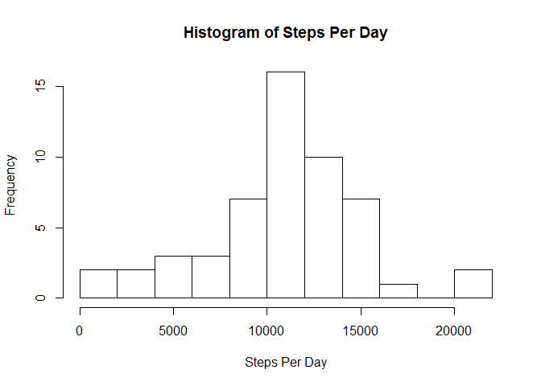
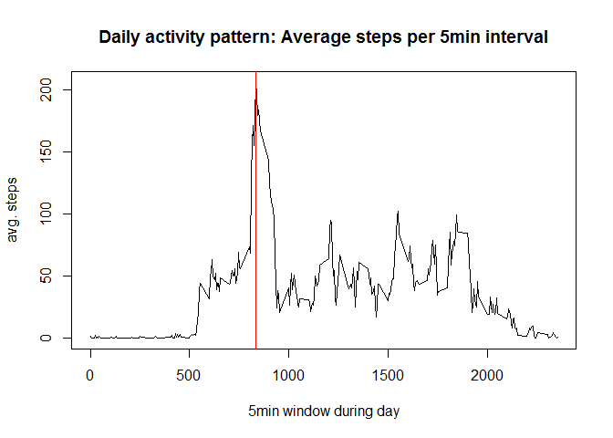
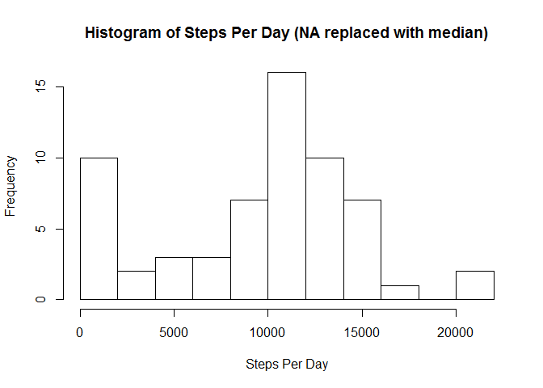
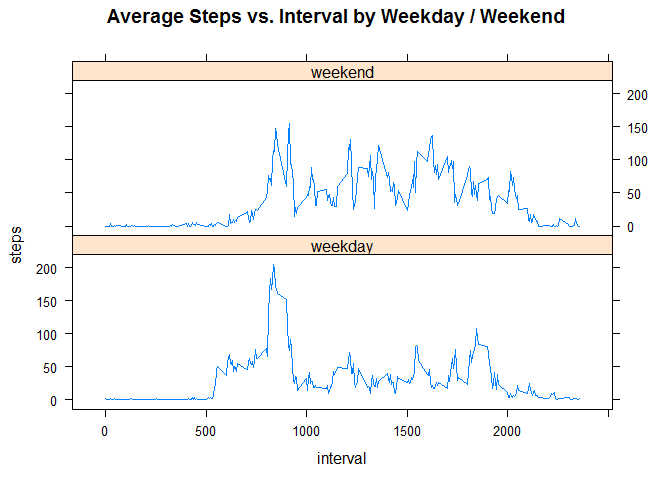

# Reproducible Research: Peer Assessment 1


## Loading and preprocessing the data
The data file is compressed in "activity.zip". Unzip the file and read the csv.

```r
utils::unzip("activity.zip")
activityData <- read.csv("activity.csv")
colnames(activityData)
```

```
## [1] "steps"    "date"     "interval"
```

## What is mean total number of steps taken per day?

```r
stepsPerDay <- aggregate(steps ~ date, data=activityData, sum)
head(stepsPerDay)
```

```
##         date steps
## 1 2012-10-02   126
## 2 2012-10-03 11352
## 3 2012-10-04 12116
## 4 2012-10-05 13294
## 5 2012-10-06 15420
## 6 2012-10-07 11015
```

```r
hist(stepsPerDay$steps,10,xlab = "Steps Per Day", main = "Histogram of Steps Per Day")
```

 

```r
meanTotalStepsPerDay <- round(mean(stepsPerDay$steps))
medianTotalStepsPerDay <- median(stepsPerDay$steps)
```
The mean total steps per day is 10766 and the median is 10765

## What is the average daily activity pattern?

```r
dailyPattern <- aggregate(steps ~ interval, data=activityData, mean)
plot(dailyPattern$interval, dailyPattern$steps, type="l", xlab="5min window during day", ylab="avg. steps", main="Daily activity pattern: Average steps per 5min interval")
maxSteps <- dailyPattern[match(max(dailyPattern$steps), dailyPattern$steps),]
abline(v=maxSteps$interval,col="red")
```

 

The interval with the highest average steps is 835 with 206.17 steps.

## Imputing missing values

```r
missingValues <- colSums(is.na(activityData))
```
There are 2304 intervals with missing data.

We will replace NA values with the median value for that interval.

```r
medianValues <- aggregate(steps ~ interval, data=activityData, median)
naRows <- is.na(activityData$steps)
imputedActivityData <- activityData
imputedActivityData[naRows,]$steps <- medianValues[match(imputedActivityData[naRows,]$interval, 
                                                         medianValues$interval),
                                                   ]$steps

impStepsPerDay <- aggregate(steps ~ date, data=imputedActivityData, sum)
head(impStepsPerDay)
```

```
##         date steps
## 1 2012-10-01  1141
## 2 2012-10-02   126
## 3 2012-10-03 11352
## 4 2012-10-04 12116
## 5 2012-10-05 13294
## 6 2012-10-06 15420
```

```r
hist(impStepsPerDay$steps,10,xlab = "Steps Per Day", main = "Histogram of Steps Per Day (NA replaced with median)")
```

 

```r
impMeanTotalStepsPerDay <- round(mean(impStepsPerDay$steps))
impMedianTotalStepsPerDay <- median(impStepsPerDay$steps)
```
After replacing NA with the median value for that interval:
The mean total steps per day is 9504 and the median is 10395

## Are there differences in activity patterns between weekdays and weekends?

```r
imputedActivityData$weekend <- as.factor(ifelse(weekdays(as.POSIXct(activityData$date)) %in% c("Saturday","Sunday"),
                                                "weekend",
                                                "weekday"))

dailyPatternWeekend <- aggregate(steps ~ interval + weekend, data=imputedActivityData, mean)

library(lattice)
```

```
## Warning: package 'lattice' was built under R version 3.1.3
```

```r
attach(dailyPatternWeekend)
xyplot(steps~interval|weekend, main = "Average Steps vs. Interval by Weekday / Weekend",layout=c(1,2),type="l")
```

 

```r
detach(dailyPatternWeekend)
```
